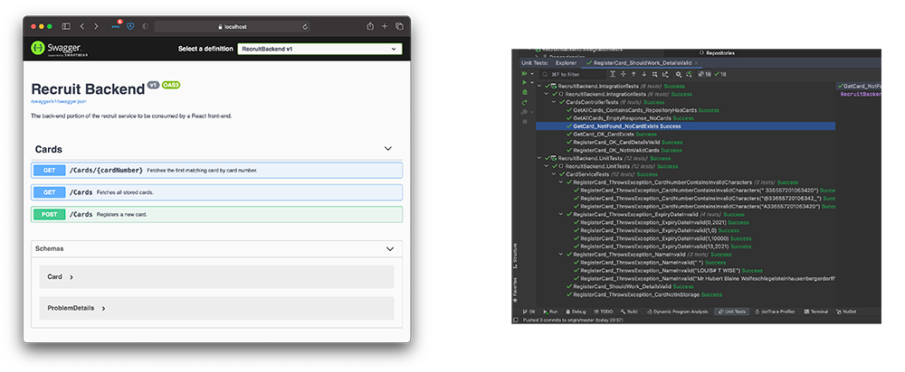

# Backend

This Recruit back-end site has been implemented using:

- .NET 5.0
- EF Core in the data layer, using:
  - SQLite for storage in the application itself
  - In-memory SQLite for integration tests
- NUnit and Moq for unit tests
- XUnit and FluentAssertions for integration tests (since greater tutorial content was available to follow)
- Swashbuckle and Swagger (as bundled with .NET Core projects) for interactive API documentation

## Setup

Using a version of your preferred IDE recent enough to support .NET 5.0, as well as the .NET 5.0 SDK itself, load the
solution as you would any other. This was developed using JetBrains Rider 2020.3 on macOS 11.1 (Intel), but you should
not face any problems loading it on Windows or Linux (...or something else?)

The `RecruitBackend` project (the web application) itself is configured to run as a console application, so you should
be able to run it directly without external depdendencies such as IIS. The SQLite database should be created for you
automatically.

The front-end is configured with the `localhost` address of this project out of the box, so you should not face any
issues in registering credit cards given that a `ValidCard` corresponds with the `Card` you're registering.

### Adding ValidCards

No API call exists to add ValidCards for security reasons, since the preferred method of adding valid cards from a
business perspective is not known. To do so, make use of a database browser such as [DB Browser for SQLite] to manually
open the database (`RecruitBackend/recruit.db`).

For each valid card you wish to add, generate a GUID either using
[Visual Studio](https://social.technet.microsoft.com/wiki/contents/articles/33047.create-guid-tool-in-visual-studio.aspx)
or using an online tool such as [GUID Generator](https://guidgenerator.com). With that GUID in the Id column, add your
desired card number next to it, and ensure you save your changes however the tool mandates.

You should now be able to register cards with those card numbers using the front-end.

## Testing

Unit tests should be discovered and run without any additional setup. Integration tests are recognised as unit tests and
should work no differently.